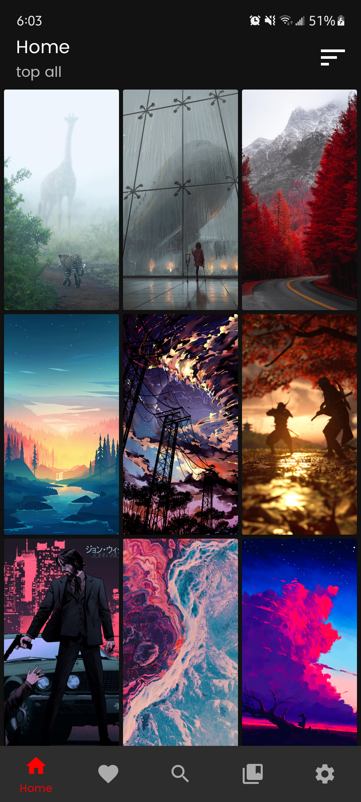
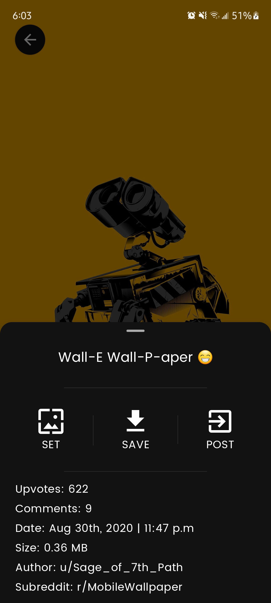

# RedditWalls-rewrite
A rewrite of [RedditWalls](https://github.com/meh430/RedditWall)

An app that uses the model-view-viewmodel pattern with the help of Android Jetpack libraries and pulls images from a specified subreddit to set as device wallpaper

## Features
- Uses latest architecture components and libraries: data binding, Room, coroutines, livedata, kotlin flows, dependency injection with Hilt, Navigation component, WorkManager
- Loads images from a specified subreddit into a customizable gridview user interface
- Preview image and have the option to set it as a wallpaper
- Options between setting the home or lock screen wallpaper
- Specify a default subreddit to load from on start up
- Sort Reddit images by new, hot, or top
- Search for subreddits
- Search for specific images inside a subreddit
- Ability to download the image
- Save favorite images to be viewed later
- Place a widget on the homescreen that allows you to quickly switch to another random wallpaper from you favorites list
- Set periodic refresh of wallpapers from favorites list

### Screenshots

## Download
Download the apk [here](https://github.com/meh430/RedditWalls-rewrite/releases/download/1.0/rw1.0.apk)
